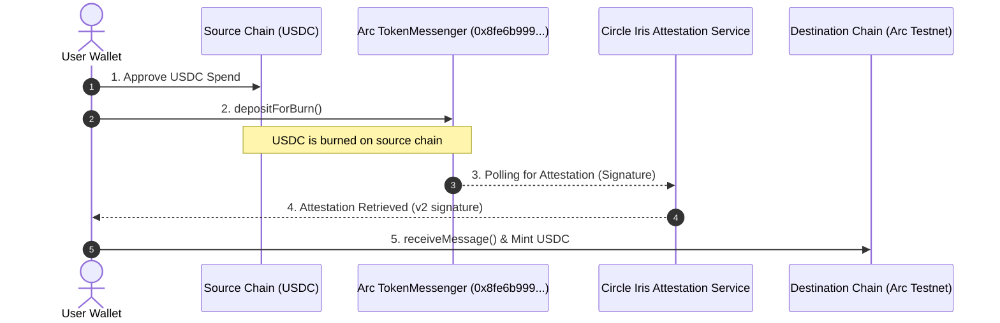

# 🌌 ArcShift USDC Bridge: Next-Gen Cross-Chain Liquidity Layer

Introducing **ArcShift**, the state-of-the-art cross-chain USDC portal built specifically for low-latency bridging across **23 EVM networks** leveraging Circle's **CCTP V2 (Cross-Chain Transfer Protocol)** architecture and **Arc Network** core relays.

---

## 🚀 Key Innovations & Premium Features

### 1. 💼 Unified Portfolio Engine
Forget jumping between multiple block explorers or adding dozens of networks manually just to check your balances. ArcShift aggregates all supported testnet balances in a sleek, glassmorphic slide-out drawer utilizing parallel RPC querying with bulletproof multi-node fallbacks.

### 2. ⚡ Bulletproof OKX Wallet Compatibility
OP Stack testnets running outdated node engines frequently fail standard `eth_estimateGas` calls, disabling the "Confirm" button for OKX and other browser wallets. ArcShift solves this natively:
* **Dynamic Node Overrides:** Checks and prompts custom RPC endpoints when needed.
* **Smart Gas Parameter Injection:** Fallback legacy (Type 0) parameter routing forces contract calls (Approve, Burn, Mint) to display correct network fees instantly.

### 3. 📊 Live Transaction Ledger & Leaderboard
Every bridge event is permanently recorded in a Supabase-backed off-chain registry. 
* **Real-time Stats:** Track total volume, active bridgers, and average transaction sizes.
* **Bridger Leaderboard:** Ranked gamification highlighting the top wallets with custom medal highlights (`🥇`, `🥈`, `🥉`).
* **Source Share & Routes:** Visual insights into routing liquidity.

---

## 🗺️ Visual Architecture Flow

---

## 🔗 The 23 Supported Testnet Ecosystem

ArcShift supports a massive matrix of EVM networks. Here is the full registry:

| Chain Name | Chain ID | CCTP Domain | USDC Token Address | RPC Provider | Explorer |
| :--- | :---: | :---: | :--- | :--- | :--- |
| **Arc Testnet** | `5042002` | `26` | `0x3600000000000000000000000000000000000000` | Arc Network Node | [ArcScan](https://testnet.arcscan.app) |
| **Ethereum Sepolia** | `11155111` | `0` | `0x1c7D4B196Cb0C7B01d743Fbc6116a902379C7238` | PublicNode / Sepolia | [Etherscan](https://sepolia.etherscan.io) |
| **Base Sepolia** | `84532` | `6` | `0x036CbD53842c5426634e7929541eC2318f3dCF7e` | Base Dev Node | [BaseScan](https://sepolia.basescan.org) |
| **Arbitrum Sepolia** | `421614` | `3` | `0x75faf114eafb1BDbe2F0316DF893fd58CE46AA4d` | Arbitrum Rollup | [ArbiScan](https://sepolia.arbiscan.io) |
| **Avalanche Fuji** | `43113` | `1` | `0x5425890298aed601595a70AB815c96711a31Bc65` | Ava Labs C-Chain | [SnowTrace](https://testnet.snowtrace.io) |
| **OP Sepolia** | `11155420` | `2` | `0x5fd84259d66Cd46123540766Be93DFE6D43130D7` | Optimism Org | [Etherscan](https://sepolia-optimism.etherscan.io) |
| **Unichain Sepolia** | `1301` | `10` | `0x31d0220469e10c4E71834a79b1f276d740d3768F` | Uniswap Gateway | [BlockScout](https://unichain-sepolia.blockscout.com) |
| **Ink Sepolia** | `763373` | `21` | `0xFabab97dCE620294D2B0b0e46C68964e326300Ac` | Gelato Node | [InkExplorer](https://explorer-sepolia.inkonchain.com) |
| **Sonic Testnet** | `14601` | `13` | `0x0BA304580ee7c9a980CF72e55f5Ed2E9fd30Bc51` | Sonic Labs | [SonicScan](https://testnet.sonicscan.org) |
| **Monad Testnet** | `10143` | `15` | `0x534b2f3A21130d7a60830c2Df862319e593943A3` | Monad Dev Node | [MonadExplorer](https://testnet.monadexplorer.com) |
| **Sei Testnet** | `1328` | `12` | `0x389082910ee7c9a980CF72e55f5Ed2E9fd30Bc51` | Sei APIs | [SeiTrace](https://seitrace.com) |
| **Linea Sepolia** | `59141` | `11` | `0xFEce4462D57bD51A6A552365A011b95f0E16d9B7` | Linea Build | [LineaScan](https://sepolia.lineascan.build) |
| **Polygon Amoy** | `80002` | `7` | `0x41E94Eb019C0762f9Bfcf9Fb1E58725BfB0e7582` | Polygon Tech | [AmoyScan](https://amoy.polygonscan.com) |
| **HyperEVM** | `998` | `19` | `0x2B3370eE501B4a559b57D449569354196457D8Ab` | Purrsec Node | [Purrsec](https://testnet.purrsec.com) |

> [!NOTE]
> All CCTP V2 transactions on testnets route using the custom **ArcMessenger** contract: `0x8fe6b999dc680ccfdd5bf7eb0974218be2542daa` and **ArcMessageTransmitter**: `0xe737e5cebeeba77efe34d4aa090756590b1ce275`.

---

## 📣 Ready-to-Post Promo Thread (for X / Twitter)

### Tweet 1 🧵
> 🌌 Meet **ArcShift** — the premium cross-chain portal built for ultra-fast USDC bridging across 23 EVM networks! 🚀
> 
> Leveraging Circle CCTP v2 infrastructure to bring instant, zero-slippage liquidity routing straight to testnet ecosystems.
> 
> Try it now: [arcshift-usdc-bridge.vercel.app](https://arcshift-usdc-bridge.vercel.app) 🔗

### Tweet 2 🧵
> Tired of "Network fee --" or disabled "Confirm" buttons in your wallet on testnets? 🛠️
> 
> ArcShift dynamically overrides gas estimation pitfalls on OP Stack nodes (Optimism, Unichain, Ink Sepolia) using legacy transaction parameter injection. 
> 
> Seamless bridging in any wallet (including OKX)! 💼

### Tweet 3 🧵
> 📊 Explore the **Live Analytics Engine**:
> * **Leaderboard:** Track top bridgers with 🥇 🥈 🥉 ranking.
> * **Unified Portfolio:** Instantly fetch balances across all 23 networks in a single drawer with robust multi-node fallbacks.
> * **Source Share:** Visual insights into routing liquidity.
> 
> Let's make cross-chain UX beautiful. 🎨✨
