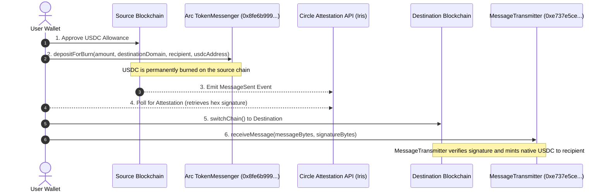

# 🌌 Bridgr USDC Bridge: The Complete A-to-Z Technical Breakdown

Welcome to the comprehensive technical article for **Bridgr**, a premium, production-ready cross-chain USDC portal. Bridgr is engineered to support low-latency swaps across **23 EVM networks** leveraging Circle's **CCTP V2 (Cross-Chain Transfer Protocol)** infrastructure and **Arc Network** core relays.

This article details the architecture, technical workarounds for wallet compatibility, the database schema, RPC resilience layers, and the user interface design.

---

## 🗺️ 1. High-Level Architecture & CCTP V2 Workflow

Bridgr is a non-custodial bridge. Rather than using traditional lock-and-mint pool mechanics, it uses Circle's official **CCTP (Burn-and-Mint)** model. This guarantees that bridged USDC is always native, eliminating the risk of wrapped token depegs.



---

## 🛠️ 2. Critical Problem Solved: OKX Wallet & OP Stack Gas Estimation

On OP Stack networks (like **OP Sepolia**, **Unichain Sepolia**, and **Ink Sepolia**), public RPC nodes running certain versions of `reth` or `geth` frequently fail to estimate gas prices properly for complex contract writes from browser extension wallets. 

### The Bug:
When calling standard Wagmi `writeContract` functions, wallets like **OKX Wallet** invoke `eth_estimateGas` behind the scenes. Because of node-level estimation discrepancies on these specific rollups, the wallet returns `Network fee --` and disables the **Confirm** sign button, blocking the transaction.

### The Bridgr Solution:
Bridgr detects if the source or destination chain is an OP Stack rollup and injects custom parameters dynamically:
1. **Dynamic Gas Price Loading:** Queries the exact live gas price directly from the provider using `getGasPrice`.
2. **Explicit Gas Limit Defs:** Replaces variable auto-estimation with a hardcoded buffer (e.g., `150,000` gas for approvals, `300,000` for burns, and `400,000` for mints).
3. **Legacy Transaction Type Enforcement:** Passes `type: 'legacy'` to the write call, forcing the wallet to display the transaction fee as `Gas Limit * Gas Price` instantly without relying on internal `eth_estimateGas` simulations.

Here is the exact code pattern used in the bridge hook:
```typescript
const isOpStack = [11155420, 1301, 763373].includes(fromChain.id);

approveHash = await writeContract(config, {
  address: fromChain.usdcAddress as `0x${string}`,
  abi: ERC20_ABI,
  functionName: 'approve',
  args: [tokenMessenger as `0x${string}`, amountInUnits],
  chainId: fromChain.id as any,
  ...(isOpStack ? {
    gas: BigInt(150000),
    gasPrice: currentGasPrice,
    type: 'legacy'
  } : {})
});
```

---

## 💼 3. The Unified Portfolio Engine (Multi-RPC Fallback Layer)

Checking token balances across 23 different testnet environments is slow and prone to rate limits. Bridgr implements a **Parallel Portfolio Loader** inside `components/bridge/UnifiedPortfolioDrawer.tsx`.

### Parallel Batching:
When the portfolio drawer is opened, it fires 23 concurrent HTTP `eth_call` requests using clean hex payload mapping for the ERC-20 `balanceOf(address)` method:
```typescript
const cleanAddress = userAddress.toLowerCase().replace('0x', '');
const data = `0x70a08231000000000000000000000000${cleanAddress}`;
```

### Multi-RPC Resilience:
Public RPC nodes are prone to downtime. To guarantee the portfolio always loads:
1. Every chain definition has a primary `rpcUrl`.
2. If the primary RPC returns a `fetch` error or times out, the engine loops through a list of secondary fallback RPC endpoints (`BACKUP_RPCS`) until it obtains a valid balance.
3. Every request has a strict **5-second timeout signal** (`AbortSignal.timeout(5000)`) preventing a single lagging node from delaying the rest of the portfolio load.

---

## 📊 4. Database Architecture & Filtered Analytics

Every successfully executed cross-chain transaction is recorded in a Supabase database instance.

### Ledger Database Schema (`bridge_transactions`):
* `id` (Text, Primary Key): The source burn transaction hash.
* `user_address` (Text): Lowcase wallet address.
* `from_chain_id` (Numeric): Source network ID.
* `to_chain_id` (Numeric): Destination network ID.
* `amount` (Text): Swapped USDC value.
* `status` (Text): Enum (`pending` | `success` | `failed`).
* `burn_tx_hash` (Text): Source transaction hash.
* `mint_tx_hash` (Text): Destination mint transaction hash.
* `timestamp` (Numeric): Epoch millisecond when the transaction was logged.

### Clean Data Pipeline:
To maintain a high-signal dashboard, **only transactions with `status === 'success'`** are computed in the live analytics metrics. All pending or failed swaps are filtered out in real-time. This affects:
* **Total Bridges Count:** Sum of successful transfers.
* **Total Volume:** Sum of USDC amounts on successful swaps.
* **Source Chain Shares:** Percentage distribution of originating networks.
* **Top Routes:** Dynamic mapping of the busiest pathways.
* **Top Bridger Leaderboard:** Rank-ordered list of wallets sorted by total volume, displaying ranking medals (`🥇`, `🥈`, `🥉`).

---

## 🔗 5. Full Chain Registry Config

The bridge operates across these primary parameters:

| Chain Name | Chain ID | CCTP Domain | USDC Address | Primary RPC URL |
| :--- | :---: | :---: | :--- | :--- |
| **Arc Testnet** | `5042002` | `26` | `0x36000000...0000` | `https://rpc.testnet.arc.network` |
| **Ethereum Sepolia** | `11155111` | `0` | `0x1c7D4B19...7238` | `https://ethereum-sepolia-rpc.publicnode.com` |
| **Base Sepolia** | `84532` | `6` | `0x036CbD53...dCF7` | `https://sepolia.base.org` |
| **Arbitrum Sepolia** | `421614` | `3` | `0x75faf114...AA4d` | `https://sepolia-rollup.arbitrum.io/rpc` |
| **Avalanche Fuji** | `43113` | `1` | `0x54258902...Bc65` | `https://api.avax-test.network/ext/bc/C/rpc` |
| **OP Sepolia** | `11155420` | `2` | `0x5fd84259...30D7` | `https://sepolia.optimism.io` |
| **Unichain Sepolia** | `1301` | `10` | `0x31d02204...768F` | `https://sepolia.unichain.org` |
| **Ink Sepolia** | `763373` | `21` | `0xFabab97d...00Ac` | `https://rpc-sepolia.inkonchain.com` |

---

## 🎨 6. User Interface Design System

Bridgr features a modern, dark-mode design matching the **ArcID** ecosystem:
* **Backgrounds:** Slate dark (`#070B13`) with blurred gradient ambient blobs (`emerald-500/5` and `indigo-500/5`) to create visual depth.
* **Panels:** Glassmorphic borders (`bg-[#0F172A]/40` with `backdrop-blur-xl` and `border-slate-800`).
* **Animations:** Powered by `framer-motion` for drawer transitions, hover scale effects, and a custom scrolling ticker for the live activity feed.
* **Micro-interactions:** Interactive chain selectors, tooltips, responsive data tables, and search query filters.
